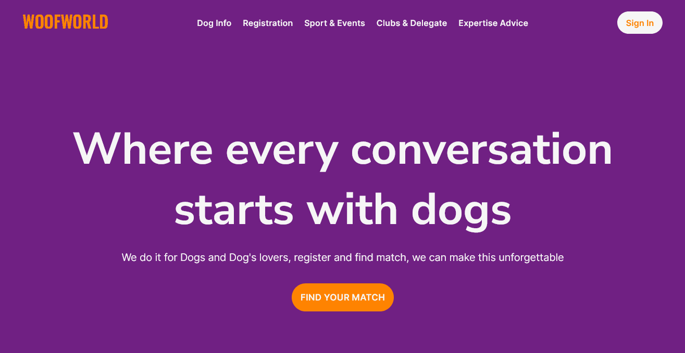
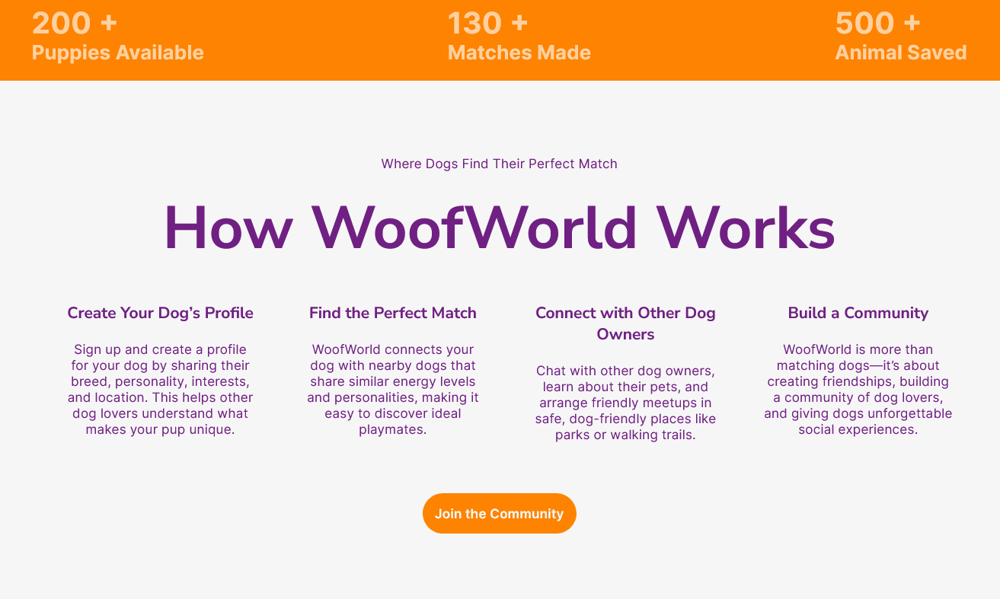
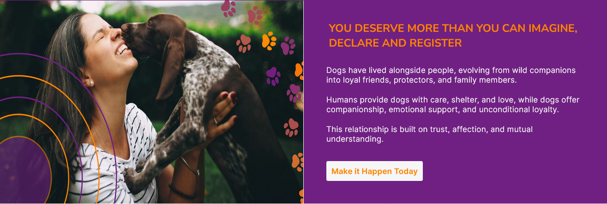
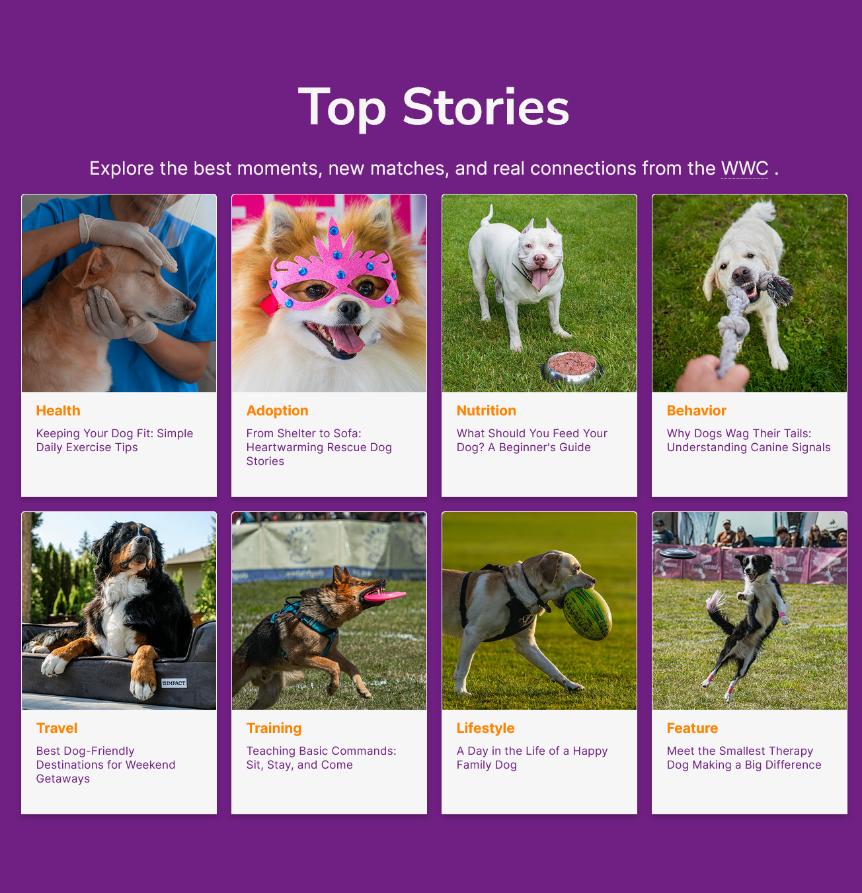
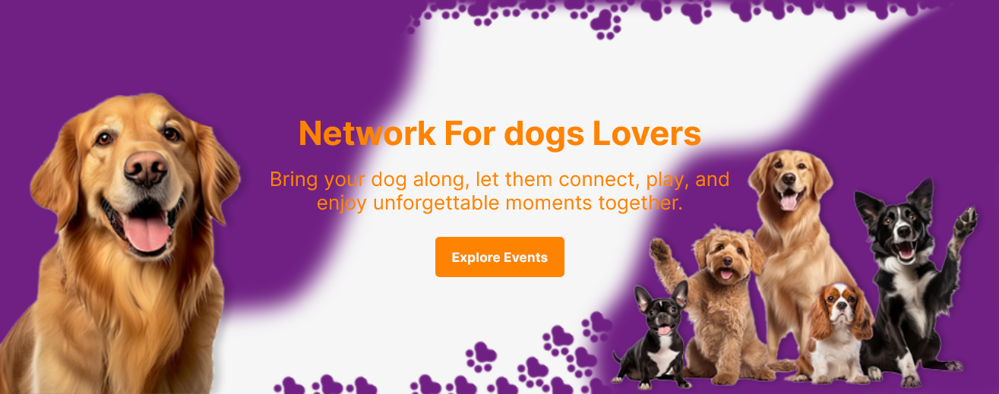
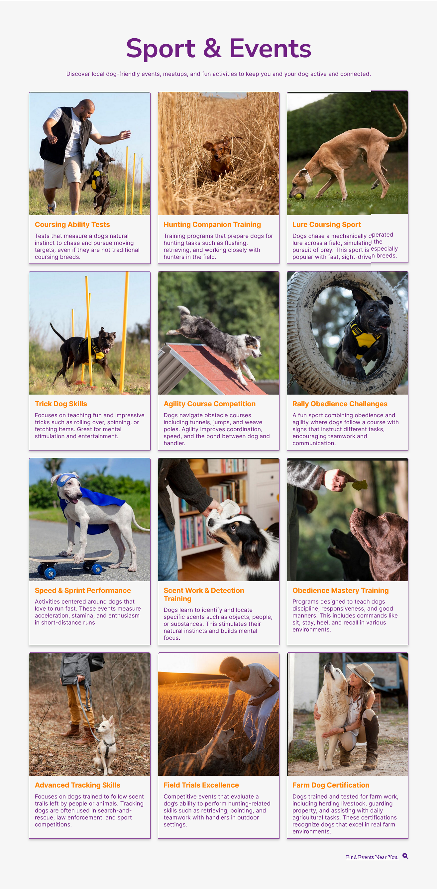
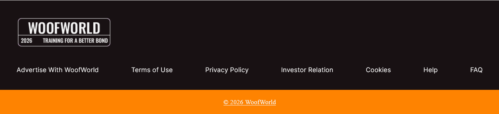

## 1. Navbar (Header)
Layout: Horizontal flex container
Left: Logo (“WoofWorld”)
Center/Right: Navigation links (Dog Info, Registration, Sports & Events, etc.)
Far Right: CTA button (“Sign In”)
Behavior: Likely display: flex; justify-content: space-between; align-items: center;

## 2. Hero Section
Layout: Full-width section with centered content
Background: Solid purple
Content Alignment: Centered vertically & horizontally
Elements:
Large headline
Short paragraph
CTA button (“Find Your Match”)
Structure: Single-column layout (text stack)

## 3. Stats Bar
Layout: Horizontal 3-column grid
Background: Orange
Each column:
Big number (e.g., 200+)
Small label (e.g., Puppies Available)
Structure: display: flex; justify-content: space-around;

## 4. “How WoofWorld Works”
Layout: Centered section with a 4-column grid
Top:
Small subtitle
Main heading
Below:
4 feature cards (Create Profile, Find Match, Connect, Community)
Bottom: Centered CTA button
Structure: Grid or flex row with equal-width columns

## 5. Split Feature Section
Layout: Two-column split
Left: Image (dog + person)
Right: Text block with CTA
Background: Purple on right side
Structure: display: flex;
50% image / 50% text

6. Top Stories
Layout: Grid-based card layout
Top:
Section title
Subtitle
Grid:
Multiple cards (3–4 columns depending on screen)
Each card contains:
Image
Category label
Title
Short description
Background: Purple
Structure: CSS Grid (grid-template-columns: repeat(auto-fit, minmax(...)))

7. Network Dogs Lovers Banner
Layout: Split but more decorative
Left: Large dog image
Right: Text + CTA
Extra decorative dog images floating/right
Background: Purple with graphic shapes
Structure: Flex + positioned images (some position: absolute likely)

## 8. Sport & Events
Layout: Grid-heavy section
Top:
Title + subtitle centered
Main Content:
Multi-row card grid (3 columns)
Each card:
Image
Title
Description
Bottom: “Explore More” link
Structure: CSS Grid

## 9. Footer
Layout: Multi-column footer
Top: Logo
Links:
Terms, Privacy, Register, Contact, Help, FAQ
Bottom: Copyright bar
Structure: Flex or grid with stacked links

 Overall Layout Pattern
Uses a mix of:
Flexbox → for rows, navbars, splits
CSS Grid → for cards and content sections
Spacing strategy:
Large vertical padding between sections
Consistent max-width container (centered content)